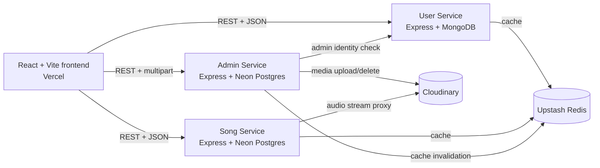

# MusicCloud.app

A full-stack music library built as a small TypeScript microservice system. Users can discover albums and songs, play and download audio, manage playlists and liked songs, while administrators manage catalog media and inspect user activity.

## Stack

<p>
  
  
  
  
  
  
  
  
  
  
  
</p>

## Architecture



## Services

| Service | Local port | Responsibility | Production platform |
| --- | ---: | --- | --- |
| `userService` | `6100` | Registration, login, JWT sessions, profiles, playlists, likes, admin user data | Render Web Service |
| `songService` | `8000` | Song and album reads, Redis caching, audio download/streaming | Render Web Service |
| `AdminService` | `7000` | Admin-only album/song uploads, Cloudinary media lifecycle, deletion, catalog operations | Render Web Service |
| `frontend` | `5173` | React UI, protected routes, player, public welcome page | Vercel |

## Repository Layout

```text
MusicCloudApp/
├── AdminService/             # Catalog administration API
│   ├── migrations/           # Database migrations
│   └── src/
├── songService/              # Public catalog and audio API
│   ├── scripts/              # Optional local data scripts
│   └── src/
├── userService/              # Authentication and user API
│   ├── seed-admin.mjs        # Optional local admin seeder
│   └── src/
├── frontend/                 # React + Vite application
│   ├── public/
│   └── src/
├── .github/workflows/ci.yml  # Build/lint CI for all applications
├── render.yaml               # Render service definitions
├── */Dockerfile              # Container build for each backend service
└── Frontend_Api_Contract.md  # Endpoint contract for frontend integration
```

## Main User Flows

1. The frontend loads the user session from a JWT stored in the browser.
2. Unauthenticated users are sent to `/welcome`.
3. Authenticated users can access the protected music application.
4. The song service reads catalog data from Neon Postgres and caches read responses in Upstash Redis.
5. Admin writes invalidate the shared song and album cache keys.
6. Audio is stored and managed through Cloudinary and streamed through the song service.
7. Admin routes require a valid user token and the `admin` role.

## Support Requests and Admin Promotion

The public `/requests` page lets users prepare an email to `tochukwusun24@gmail.com` for:

- Password reset requests
- Song posting requests

The page does not collect passwords and does not claim to send mail from the server. It opens the user's email client with a prefilled request.

The admin users page includes a `Make admin` action. The API endpoint is:

```text
PATCH /api/v1/user/users/:userId/admin
```

The endpoint requires a valid JWT and verifies that the requester already has the `admin` role on the server. A frontend route guard alone is not treated as security.

## API Base URLs

Local defaults:

```text
Frontend:      http://localhost:5173
User service:  http://localhost:6100/api/v1
Song service:  http://localhost:8000/api/v1
Admin service: http://localhost:7000/api/v1/admin
```

The full endpoint list, payloads, auth headers, and examples are in [Frontend_Api_Contract.md](Frontend_Api_Contract.md).

## Local Setup

Requirements:

- Node.js 24+
- npm 11+
- MongoDB connection
- Neon/Postgres connection
- Upstash Redis REST credentials
- Cloudinary credentials for admin media operations

Install dependencies:

```powershell
cd AdminService
npm install

cd ../songService
npm install

cd ../userService
npm install

cd ../frontend
npm install
```

Create local `.env` files from the variable lists below. Never commit real `.env` files.

Start each backend in a separate terminal:

```powershell
cd AdminService
npm run dev
```

```powershell
cd songService
npm run dev
```

```powershell
cd userService
npm run dev
```

Start the frontend:

```powershell
cd frontend
npm run dev
```

Health checks:

```text
http://localhost:6100/health
http://localhost:8000/health
http://localhost:7000/health
```

## Environment Variables

### `userService/.env`

```text
PORT=6100
CORS_ORIGINS=http://localhost:5173
MONGO_URI=<mongodb-connection-string>
JWT_SECRET=<long-random-secret>
UPSTASH_REDIS_REST_URL=<upstash-rest-url>
UPSTASH_REDIS_REST_TOKEN=<upstash-rest-token>
```

### `songService/.env`

```text
PORT=8000
CORS_ORIGINS=http://localhost:5173
DATABASE_URL=<neon-pooled-or-direct-url>
DATABASE_URL_POOLED=<neon-pooled-url>
UPSTASH_REDIS_REST_URL=<upstash-rest-url>
UPSTASH_REDIS_REST_TOKEN=<upstash-rest-token>
```

### `AdminService/.env`

```text
PORT=7000
CORS_ORIGINS=http://localhost:5173
DATABASE_URL=<neon-direct-url>
DATABASE_URL_POOLED=<neon-pooled-url>
USER_SERVICE_URL=http://localhost:6100
JWT_SECRET=<same-or-compatible-jwt-secret>
CLOUD_NAME=<cloudinary-cloud-name>
CLOUD_API_KEY=<cloudinary-api-key>
CLOUD_API_SECRET=<cloudinary-api-secret>
UPSTASH_REDIS_REST_URL=<upstash-rest-url>
UPSTASH_REDIS_REST_TOKEN=<upstash-rest-token>
```

### `frontend/.env`

```text
VITE_USER_SERVER_URL=http://localhost:6100
VITE_SONG_SERVER_URL=http://localhost:8000
VITE_ADMIN_SERVER_URL=http://localhost:7000
```

For production, replace local URLs with the deployed Render service URLs and the Vercel frontend origin in each backend `CORS_ORIGINS` value.

## Build and Quality Checks

Run each backend build:

```powershell
cd AdminService; npm run build
cd ../songService; npm run build
cd ../userService; npm run build
```

Run frontend checks:

```powershell
cd frontend
npm run lint
npm run build
```

The same checks run automatically in [`.github/workflows/ci.yml`](.github/workflows/ci.yml) for pushes and pull requests targeting `main`.

## Deploying to Render

The root [`render.yaml`](render.yaml) defines three Docker-based Render web services:

- `musiccloud-user-service`
- `musiccloud-song-service`
- `musiccloud-admin-service`

In Render:

1. Create a Blueprint from this repository.
2. Review the three generated web services.
3. Add the secret values marked `sync: false`.
4. Set `CORS_ORIGINS` to the deployed Vercel origin, for example `https://your-app.vercel.app`.
5. Set `USER_SERVICE_URL` on AdminService to the deployed user-service URL.
6. Run the AdminService migration once against the production database if the schema is not current.
7. Confirm each `/health` endpoint is green.

Render provides the `PORT` environment variable. The Dockerfiles expose `10000`, while the Express servers honor Render's injected port at runtime.

Docker can also be deployed manually without the Blueprint:

```powershell
docker build -t musiccloud-user ./userService
docker build -t musiccloud-song ./songService
docker build -t musiccloud-admin ./AdminService
```

Each container requires its service-specific environment variables at runtime. Do not copy `.env` files into images.

## Deploying to Vercel

The Vercel project root should be `frontend`.

Build settings:

```text
Framework preset: Vite
Install command: npm ci
Build command: npm run build
Output directory: dist
```

Add these Vercel environment variables:

```text
VITE_USER_SERVER_URL=https://your-user-service.onrender.com
VITE_SONG_SERVER_URL=https://your-song-service.onrender.com
VITE_ADMIN_SERVER_URL=https://your-admin-service.onrender.com
```

[`frontend/vercel.json`](frontend/vercel.json) rewrites client-side routes to `index.html`, so routes such as `/welcome`, `/song/:id`, and `/album/:id` work after a browser refresh.

